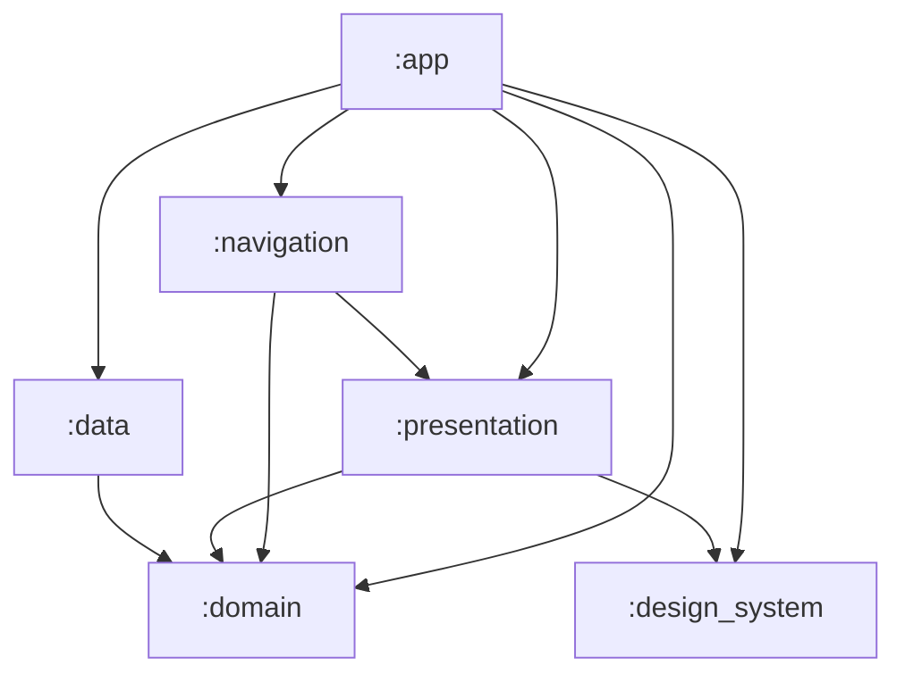
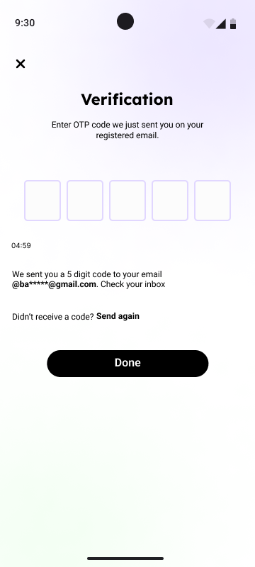

# ✨ Pearl — Skincare & Dermatology Companion

[](https://developer.android.com/)
[](https://kotlinlang.org/)
[](https://developer.android.com/jetpack/compose)
[](https://developer.android.com/topic/architecture)
[](https://dagger.dev/hilt/)
[-blue?style=for-the-badge)](https://developer.android.com/about/versions/oreo)
[](https://developer.android.com/about/versions)

---

## 📌 Overview

**Pearl** is an Android application designed to revolutionize skincare management and dermatology consultations. Pearl provides personalized skin diagnostics, tailored morning and evening routines, smart product recommendation engines, ingredient safety checks, and an appointment booking ecosystem connecting users with top dermatologists.

Built using **Jetpack Compose**, **Clean Architecture**, and **MVVM**, Pearl adheres to Android best practices, leveraging modern asynchronous reactive streams and dependency injection.

---

## 🚀 Key Features & Required Functionality

### 🔐 1. Authentication & Security
- **Multi-Factor Auth**: Sign in and sign up backed by **Firebase Authentication**.
- **SMS OTP Verification**: Automated SMS verification via **Twilio API** combined with **Google Play SMS Retrieval API** for zero-touch OTP autofill.
- **Phone Input Support**: Country code selection powered by `xMaterialccp`.
- **Password Recovery & Security**: Change password, reset password via email or phone, and account deletion flows.

### 🧪 2. Skin Diagnostic Quiz & Personalization
- Interactive questionnaire evaluating user skin health, skin type (**OILY**, **DRY**, **NORMAL**), main concerns (Acne, Sensitivity, Aging, Pigmentation), and nutritional habits.
- Real-time skin score calculation with answers saved to **Firebase Realtime Database**.

### 🧴 3. Customized Skincare & Nutrition Routines
- **Morning & Evening Routines**: Step-by-step skincare guide with product assignment and completion toggles.
- **Ingredient Safety Analyzer**: Highlights beneficial vs. hazardous/avoidable ingredients based on skin type.
- **Nutrition & Hydration Tracker**: Tailored dietary suggestions and healthy recipes for glowing skin.
- **Routine Maintenance**: Add/remove products and track routine consistency over time.

### 🛍️ 4. Product Catalog & Recommendations
- Searchable product catalog categorized by type (Cleansers, Moisturizers, Sunscreens, Serums, etc.).
- Detailed product view containing ingredients, usage instructions, safety warnings, and ratings.
- Personalized recommendation engine suggesting suitable products based on skin quiz diagnostics.

### 👨‍⚕️ 5. Dermatologist Consultations & Appointments
- **Dermatologist Directory**: Browse verified dermatologists complete with ratings, years of experience, locations, and reviews.
- **Appointment Booking**: Select preferred date/time slots for **Online** or **In-Person** consultations.
- **Checkout & Summary**: Review appointment details, consultation breakdown, mock payment processing, and confirmation screen.
- **My Appointments Hub**: View upcoming and historical medical appointments.

### 💬 6. Community, Notifications & Utilities
- **Community Feed**: Connect with other users, share skincare journeys, ask questions, and discover expert tips.
- **Notification Center**: Activity alerts categorized into General and Community updates.
- **Favorites Hub**: Save preferred products and bookmarked dermatologists for quick access.
- **QR Code Utility**: Scan and share QR codes for quick profile and product lookup.

---

## 🏗️ Architecture & Multi-Module Hierarchy

The project follows strict **Clean Architecture** principles enforced by a **multi-module Gradle setup** alongside the **MVVM (Model-View-ViewModel)** design pattern. This ensures a robust separation of concerns, faster build times, and framework independence.



### 📐 Module Breakdown & Dependency Rule

The dependency rule states that **inner modules (Domain) must not know anything about outer modules (Data or Presentation)**.

#### 1. 🧠 `:domain` (Pure Kotlin Layer)
- **Zero Android Dependencies**: A pure Kotlin library module.
- **Entities / Models**: Core data models (`User`, `Doctor`, `Product`, `Routine`, `UserAddress`).
- **Repository Interfaces**: Abstract contracts defining data operations.
- **Use Cases**: Granular units encapsulating business rules (e.g., `SignUp`, `GetDoctorDetailsUseCase`, `SaveAnswersUseCase`).

#### 2. 💾 `:data` (Data Sources & Implementations)
- Implements repository contracts defined in the `:domain` module.
- **Local Data Sources**: 
  - **Room Database** (`PearlDatabase`, `DoctorEntity`, `ProductEntity`, `PearlTypeConverter`) for offline caching and entity mapping.
  - **Preferences DataStore** (`LocalManagerImpl`) for user session flags and app entry state.
- **Remote Data Sources**:
  - **Firebase Authentication & Realtime Database** for user data and sync.
  - **Retrofit & OkHttp** (`TwilioApiService`) for RESTful SMS API requests.

#### 3. 🎨 `:presentation` (Compose UI & ViewModels)
- Depends on `:domain` and `:design_system`.
- Built entirely with **Jetpack Compose**.
- **ViewModels**: Expose reactive UI state using `StateFlow` and process single-shot events via `MVI / Event` patterns.
- Feature screens isolated from implementation details.

#### 4. 🧭 `:navigation` (Navigation Graph)
- Depends on `:presentation` and `:domain`.
- **NavGraph**: Centralized compose navigation (`PearlNavigator`) with typed routes.

#### 5. 💅 `:design_system` (UI Kit)
- Core design tokens (Colors, Typography, Themes).
- Reusable Compose UI components (`PrimaryButton`, `ErrorDialog`, `TopAppBar`, etc.).
- Shared drawable resources to ensure UI consistency across features.

#### 6. 📱 `:app` (Application & DI Layer)
- Ties everything together.
- Managed by **Dagger-Hilt** for Dependency Injection.
- Configures singleton instances (`AppModule`) for Firebase, Retrofit, Room DB, Repositories, and Use Case wrappers.

#### 7. 🛠 `:build-logic` (Convention Plugins)
- Custom Gradle plugins (`pearl.android.library`, `pearl.android.hilt`, etc.) using Version Catalogs (`libs.versions.toml`).
- Centralizes and simplifies build configuration across all modules.

---

## 📦 Dependencies & Tech Stack

All dependencies are managed centrally via a Gradle Version Catalog (`libs.versions.toml`):

### 🛠️ Core & Architecture
| Dependency | Version | Badge |
| :--- | :---: | :--- |
| **Android Core KTX** | `1.19.0` |  |
| **Lifecycle Runtime KTX** | `2.11.0` |  |
| **Kotlin Version** | `2.2.10` |  |
| **Activity Compose** | `1.13.0` |  |
| **Splash Screen API** | `1.0.1` |  |

### 🎨 Jetpack Compose & UI
| Dependency | Version | Badge |
| :--- | :---: | :--- |
| **Compose BOM** | `2026.02.01` |  |
| **Compose Navigation** | `2.8.5` |  |
| **Accompanist System UI Controller** | `0.31.4-beta` |  |
| **Country Code Picker (xMaterialccp)** | `v1.27` |  |

### ⚡ Dependency Injection & Asynchronous Processing
| Dependency | Version | Badge |
| :--- | :---: | :--- |
| **Dagger Hilt** | `2.60.1` |  |
| **Hilt Navigation Compose** | `1.2.0` |  |
| **Arrow Core & FX Coroutines** | `1.2.0` |  |

### 🌐 Networking & Backend
| Dependency | Version | Badge |
| :--- | :---: | :--- |
| **Retrofit** | `2.11.0` |  |
| **Gson Converter** | `2.10.1` |  |
| **Firebase Realtime Database** | `20.2.2` |  |
| **Firebase Auth** | `23.0.0` |  |
| **Firebase Messaging** | `24.0.0` |  |
| **Google Play Auth API Phone (SMS Retrieval)** | `18.0.1` |  |
| **Google Play Auth** | `20.3.0` |  |

### 💾 Data Persistence & Image Loading
| Dependency | Version | Badge |
| :--- | :---: | :--- |
| **Room Database** | `2.7.0-alpha11` |  |
| **Preferences DataStore** | `1.1.2` |  |
| **Coil Compose & GIF** | `2.7.0` / `2.2.2` |  |
| **Paging 3** | `3.1.1` |  |

---

## 📸 Screenshots & UI Showcase

The project includes an extensive UI screen showcase located in the `UI/` folder:

### 🌟 Onboarding & Introduction
| Welcome Screen | First Onboarding | Second Onboarding | Last Onboarding |
| :---: | :---: | :---: | :---: |
|  |  |  |  |

### 🔐 Authentication & Verification
| Sign Up | OTP Verification | Verification Screen |
| :---: | :---: | :---: |
|  |  |  |

### 🧪 Skin Diagnostic Quiz
| Skin Concerns | Nutrition Quiz | Skin Result |
| :---: | :---: | :---: |
|  |  |  |

### 🏠 Home, Routines & Products
| Home Dashboard | Routine Screen | Add Routine | Product Details |
| :---: | :---: | :---: | :---: |
|  |  |  |  |

### 👨‍⚕️ Dermatologist Booking & Payment
| Doctor Details | Book Appointment | Payment Method | Summary |
| :---: | :---: | :---: | :---: |
|  |  |  |  |

---

## 🛠️ Setup & Installation

### Prerequisites
- **Android Studio**: Ladybug (2024.2.1) or newer
- **JDK**: Java 17 or newer
- **Android SDK**: API Level 37

### Configuration & Secret Management
To ensure security, sensitive API keys (e.g., Twilio API credentials) are stored locally and loaded at compile-time into `BuildConfig`.

1. Clone the repository:
   ```bash
   git clone https://github.com/AbdullhGaber/PearlAndroidProjectCleanArchitecture.git
   cd PearlAndroidProjectCleanArchitecture
   ```

2. Create a `local.properties` file in the root directory if it does not exist, and insert your Twilio credentials:
   ```properties
   sdk.dir=YOUR_ANDROID_SDK_PATH

   # Twilio Secrets
   TWILIO_BASE_URL=https://api.twilio.com/
   TWILIO_SERVICE_SID=your_service_sid
   TWILIO_ACCOUNT_SID=your_account_sid
   TWILIO_AUTH_TOKEN=your_auth_token
   TEST_TWILIO_ACCOUNT_SID=your_test_account_sid
   TEST_TWILIO_AUTH_TOKEN=your_test_auth_token
   ```

3. Ensure `google-services.json` is present in the `app/` directory for Firebase initialization.

4. Sync Gradle and run the app on an emulator or physical device running Android 8.0 (API 26) or higher.

---

## 📄 License
This project is licensed under the MIT License - see the `LICENSE` file for details.
